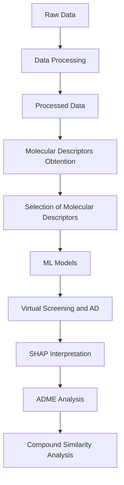

# **Anti-DENV predictor: QSAR models for the identification of active molecules against dengue virus**

In this repository you can find Anti-DENV predictor, an algorithm that predicts the activity of possible dengue virus inhibitors. It uses a quantitative structure–activity relationship (QSAR) model that correlates molecular descriptors and antiviral activity. The idea started as a Master's Thesis project and continued with the creation of Anti-DENV predictor, a machine learning-assisted computational tool that can be used by scientists to accelerate drug discovery stage of dengue virus inhibitors and select promising candidates. 

## **Description**
This repository is divided into two main folders: 01_QSAR_model_creation_and_selection and 02_AntiDENV_predictor_creation. 

01_QSAR_model_creation_and_selection contains the raw and processed data, code, and results of the developed QSAR study. In this first part, data from 5 different databases (ChEMBL, PubChem, DrugRepV, DenvInD y BindingDB) was combined and used. Also, ten different ML models (RF, SVM, K-NN, NB, LR, AdaBoost, Gradient Boosting (GB), ExtraTrees, Multilayer Perceptron (MLP) y XGBoost) were trained and tested, and SVM was chosen as the best model. Finally, a virtual screening with unknown compounds was carried out and seven molecules were chosen as promising candidates due to their high predicted antiviral activity against dengue virus. 

02_AntiDENV_predictor_creation contains the needed information for the creation and use of Anti-DENV predictor, a web page that uses an algorith to predict the activity of possible dengue virus inhibitors. The main idea behind this project is that users will upload molecule structures and the predicted activity will be shown. Therefore, it will accelerate drug discovery stage of dengue virus inhibitors.

## **01_QSAR_model_creation_and_selection**

### **Workflow**
The workflow includes data collection and processing, generation and selection of molecular descriptors, training and evaluation of ML models, interpretation of predictions using SHAP, applicability domain (AD) assessment, and virtual screening of new molecules with subsequent analysis of ADME properties of the selected molecules.
Specifically, the project follows the following workflow:

### **Repository structure**

**01_raw_data/**

Contains the original data used as the starting point for the study. More specifically, it contains data obtained from five different databases: PubChem, BindingDB, ChEMBL, DenvInD, and DrugRepV.

The data in this folder correspond to the original sources and are kept separate from the processed data to ensure the traceability of the analysis.

**02_data_processing/**

Contains the scripts and results related to data processing and cleaning. Depending on the dataset, the tasks performed include:
- Filtering records for "dengue virus".
- Filtering records based on activity values (IC50 or EC50).
- Standardization of units.
- Selection of relevant columns (SMILES structures and activity values).
- Normalization of chemical structures (canonical SMILES).
- Removal of duplicates.
- Treatment of missing values.
- Transformation of variables (activity values into 0 and 1 for inactive and active compounds, respectively).

**03_combined_data/**

Contains the combination of all processed datasets. Once combined, duplicate entries are removed to obtain the final dataset, which is subsequently used for molecular descriptor calculation and model development.

**04_molecular_descriptors/**

At this stage, molecular descriptors (Mordred descriptors) are calculated to represent the structural and physicochemical characteristics of the compounds. These descriptors are used as input variables (features) for the ML models.

**05_molecular_descriptor_selection/**

Contains the procedures used to reduce and select the set of molecular descriptors. Specifically, Pearson and Spearman correlation analyses were performed, after which the descriptor selection method that yielded the best results was selected.

The objective of this stage is to identify the most informative variables, reduce dimensionality, and avoid problems arising from redundant or highly correlated variables.

**06_ML_models/**

Contains the development and evaluation of the ML models. The models used in this study were: Random Forest, Support Vector Machines, k-NN, Naive Bayes, Logistic Regression, AdaBoost, Gradient Boosting, ExtraTrees, Multilayer Perceptron, and XGBoost.

The tasks performed include:
- Splitting the data into training and test sets.
- Training the models.
- Hyperparameter optimization.
- Cross-validation.
- Performance evaluation and comparison of the models. The evaluation metrics were accuracy, specificity, sensitivity, ROC-AUC, F1 score, and MCC.
- Selection of the final model.

**07_AD_and_Screening/**

This folder contains analyses performed after the development of the final model. Specifically, virtual screening of new molecules and applicability domain (AD) analysis were performed.

Compounds were selected as candidates only if they had an active-class probability greater than 0.8 and fell within the applicability domain.

**08_SHAP/**

SHAP (SHapley Additive exPlanations) was used to interpret the model predictions and identify the contribution of the different molecular descriptors. This makes it possible to move beyond purely numerical predictions and interpret which molecular characteristics are associated with the model's predictions.

**09_ADME/**

An analysis of the ADME (Absorption, Distribution, Metabolism, and Excretion) properties of the selected candidate compounds was performed to complement the activity prediction with a preliminary assessment of their pharmacokinetic properties.

**10_compound_similarity/**

Finally, a molecular fingerprint enrichment analysis of the candidate compounds was performed using the molecules employed for model training as a reference.

This analysis made it possible to identify molecular substructures present in the candidate compounds that were enriched in molecules classified as active compared with inactive molecules.

### **Results**
The main results obtained in the study include:
- A final dataset of 6,279 entries was used for the development of the ML models. These entries contain the SMILES structure of each compound and its activity value against the dengue virus.
- Development of ten ML models for the prediction of activity against the dengue virus.
- Selection of the SVM with a radial basis function (RBF) kernel as the best-performing model. The evaluation metrics were: accuracy = 0.811, F1 score = 0.807, specificity = 0.803, sensitivity = 0.820, ROC-AUC = 0.884, and MCC = 0.623.
- Identification of the molecular descriptors with the greatest predictive relevance through SHAP analysis.
- Assessment of prediction reliability using the applicability domain (AD).
- Prioritization of potentially interesting compounds for further studies. Specifically, seven potential candidates were identified: Islatravir, Zabicipril, Sabizabulin, Trimethoprim, Ramipril, Combretastatin A-1, and Emvododstat.
- Preliminary evaluation of the ADME properties of the prioritized compounds, with favorable results for most of them.
- Identification of molecular fingerprints that were more frequently present in active molecules compared with inactive molecules.

### **Reproducibility**
To reproduce the analysis, it is recommended to create a virtual environment and install the dependencies indicated in requirements.txt. 
