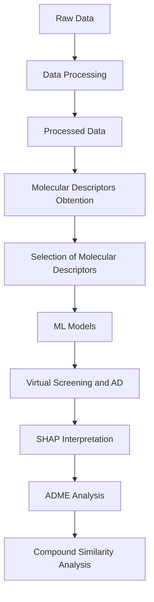

# **Anti-DENV predictor: QSAR models for the identification of active molecules against dengue virus**

In this repository you can find Anti-DENV predictor, an algorithm that predicts the activity of possible dengue virus inhibitors. It uses a quantitative structure–activity relationship (QSAR) model that correlates molecular descriptors and antiviral activity. The idea started as a Master's Thesis project and continued with the creation of Anti-DENV predictor, a machine learning-assisted computational tool that can be used by scientists to accelerate drug discovery stage of dengue virus inhibitors and select promising candidates. 

## **Description**
This repository is divided into two main folders: 01_QSAR_model_creation_and_selection and 02_AntiDENV_predictor_creation. 

01_QSAR_model_creation_and_selection contains the raw and processed data, code, and results of the developed QSAR study. In this first part, data from 5 different databases (ChEMBL, PubChem, DrugRepV, DenvInD y BindingDB) was combined and used. Also, ten different ML models (RF, SVM, K-NN, NB, LR, AdaBoost, Gradient Boosting (GB), ExtraTrees, Multilayer Perceptron (MLP) y XGBoost) were trained and tested, and SVM was chosen as the best model. Finally, a virtual screening with unknown compounds was carried out and seven molecules were chosen as promising candidates due to their high predicted antiviral activity against dengue virus. 

02_AntiDENV_predictor_creation contains the needed information for the creation and use of Anti-DENV predictor, a web page that uses an algorith to predict the activity of possible dengue virus inhibitors. The main idea behind this project is that users will upload molecule structures and the predicted activity will be shown. Therefore, it will accelerate drug discovery stage of dengue virus inhibitors.

## **Workflow**
The workflow includes data collection and processing, generation and selection of molecular descriptors, training and evaluation of ML models, interpretation of predictions using SHAP, applicability domain (AD) assessment, and virtual screening of new molecules with subsequent analysis of ADME properties of the selected molecules.
Specifically, the project follows the following workflow:

## **Reproducibility**
To reproduce the analysis, it is recommended to create a virtual environment and install the dependencies indicated in requirements.txt. 
