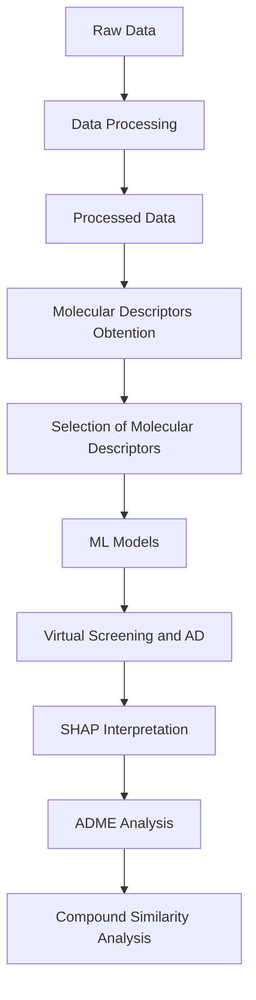

# **QSAR models for the identification of active molecules against dengue virus**

In this repository you can find Anti-DENV predictor, an algorithm that predicts the activity of possible dengue virus inhibitors. It uses a quantitative structure–activity relationship (QSAR) model that correlates molecular descriptors and antiviral activity. The idea started as a Master's Thesis project and continued with the creation of Anti-DENV predictor, a machine learning-assisted computational tool that can be used by scientists to accelerate drug discovery stage of dengue virus inhibitors and select promising candidates. 

## **Description and main purpose**
This repository contains the raw and processed data, code, and results of a QSAR (Quantitative Structure-Activity Relationship) study aimed at developing predictive models for identifying molecules with potential antiviral activity against the dengue virus.

The main purpose of the project is to use the activity values ​​and molecular descriptors of compounds that were previously evaluated experimentally to develop Machine Learning (ML) models capable of predicting the antiviral activity of new molecules and facilitating their subsequent application in virtual screening processes.

## **Workflow**
The workflow includes data collection and processing, generation and selection of molecular descriptors, training and evaluation of ML models, interpretation of predictions using SHAP, applicability domain (AD) assessment, and virtual screening of new molecules with subsequent analysis of ADME properties of the selected molecules.
Specifically, the project follows the following workflow:

## **Reproducibility**
To reproduce the analysis, it is recommended to create a virtual environment and install the dependencies indicated in requirements.txt.
